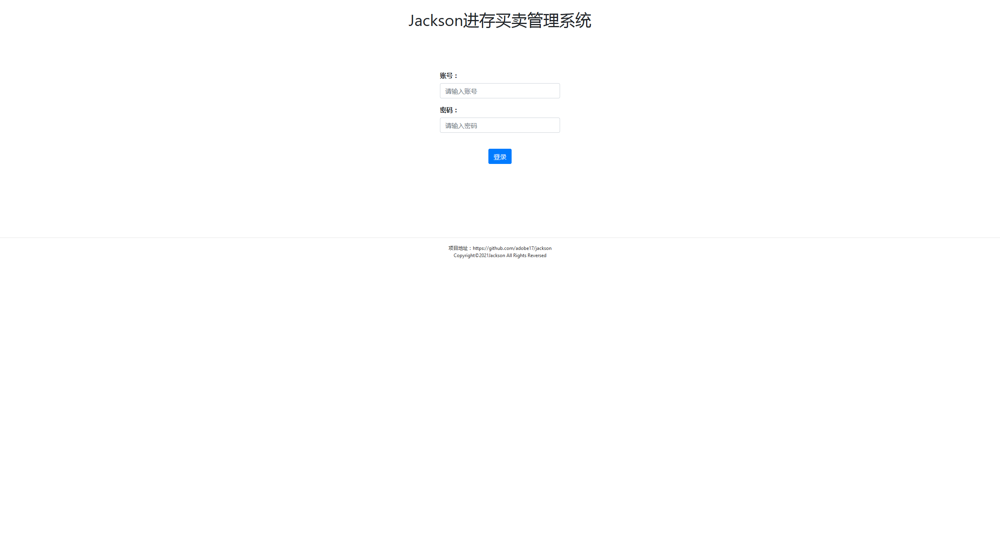
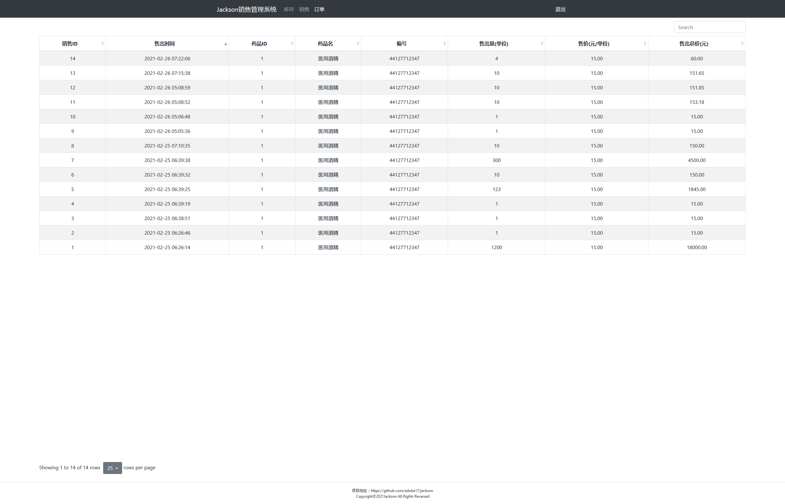
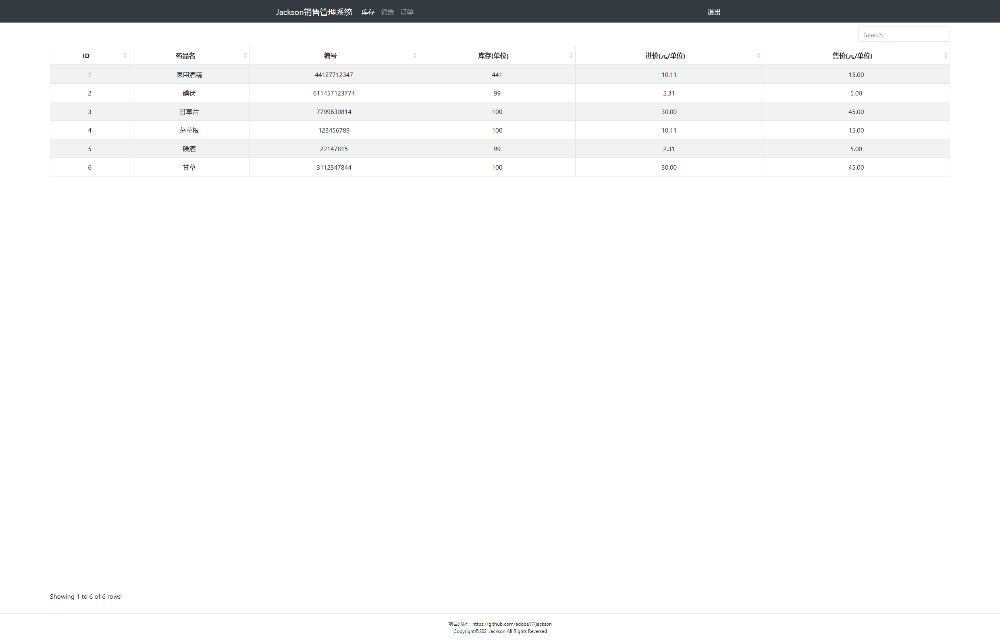
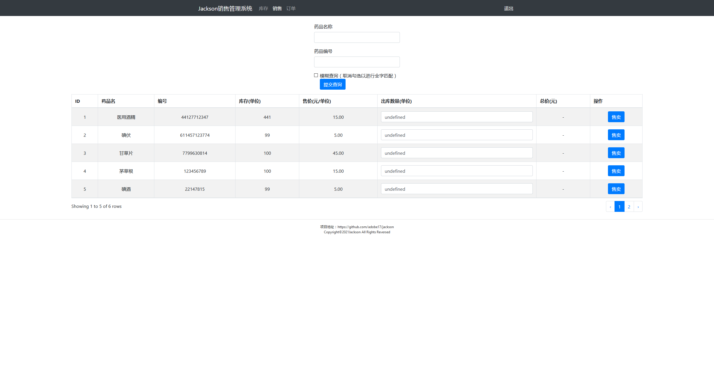

# Jackson销售管理系统
# 许可证声明
听闻GitHub开发的Copilot直接照抄Github已有代码并纳为己用并且意图商业化，爷我直接变更许可证为GPLv3虽然我知道这没有什么diao用，但是爷我还是要通过我变更LICENSE来表示反对！
---
## 鸣谢
采用`SlightPHP`框架，项目地址：https://github.com/hetao29/slightphp
参考`smpss进销存管理系统`，项目地址：https://github.com/nullforyou/smpss

## 系统说明
* 测试环境：
  * Debian
  * Apache `2.4.46 (Debian)`
  * MariaDB `10.5.8`
  * PHP `7.4.15`
* 依赖框架及组件
  * jQuery
  * Bootstrap
  * Vue.js
* 实现功能
  * 用户登录及退出
  * 数据库查询及出库
  * 记录出库日志

## 部署说明
__需要设置php.ini中`output_buffering = 7000`，如数据量较大，无法正常执行时请增大该值或设为`On`__
* MySQL数据库内容存放于根目录下`jsckson.sql`，如需修改数据库配置，请前往`app/php/mysql.page.php`修改`SQLConnect()`中的相关参数。可用参数请查看`vendor/hetao29/slightphp/wiki/SDb.md`
* 若下载整个源码到网站主目录下，如：`/var/www/html/`直接启动即可
* 若下载到主目录下子目录，如：`/var/www/html/jackson/`，则需要在此目录下设置`Apache VirtualHost`然后访问对应虚拟端口，如：`http://ip:81/`即可
<pre><code>
Listen 81
&lt;VirtualHost *:81&gt;
    DocumentRoot /var/www/html/jackson
    ServerName 127.0.0.1:81
&lt;/VirtualHost&gt;
&lt;Directory "/var/www/html/jackson"&gt;
    Options Indexes FollowSymLinks
    AllowOverride All
    Order allow,deny
    Allow from all
&lt;/Directory&gt;
</code></pre>

# 截图示例

## 重要注释
* `app/php/`的文件夹`js`，`images`，`css`均为开发时方便Dreamweaver进行读取所设，无实际意义，实际引用资源均来自于`根目录`下的对应文件夹
* 此项目开发时并未使用外部引入图片，`images`文件夹下为创建Bootstrap模板时自动生成的占位图，个人予以保留，以便后期(~~万一哪一天不开窍想起来了~~)开发时使用~其实就是懒~。
* 此项目未实现`进货存放`与`用户管理`的相关内容，但是依据已有的函数和前端页面，可以快速简单实现以上两项功能。
* __此项目并非为实际生产环境设计！！！因此除了简单的数据验证外，未添加任何安全防范措施，如SQL注入过滤，XSS过滤，前端密码加密等措施！！！切勿随意用于生产环境！！！__
